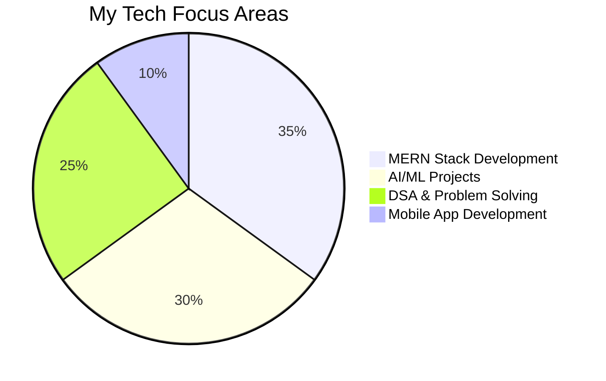

# Hey there! 👋 I'm Sweedel Rodrigues

<div align="center">
  
  

  **3rd Year Information Science & Engineering Student**  
  📍 Dayananda Sagar College of Engineering (DSCE)

  [](https://linkedin.com/in/sweedel-rodrigues)
  [](mailto:sweedel171@gmail.com)
  [](https://github.com/yourusername)

</div>

---

## 🚀 About Me

I'm a passionate developer who believes in **learning by building**. My journey spans across full-stack web development, artificial intelligence, and algorithmic problem-solving. I thrive on transforming ideas into functional applications and constantly push myself to learn new technologies.

> *"Code is like humor. When you have to explain it, it's bad." – Cory House*

### 🎯 What Drives Me

- 🌐 Building scalable, user-centric web applications
- 🤖 Exploring the intersection of AI/ML and real-world problems
- 💡 Solving complex problems with elegant, efficient code
- 🎨 Bringing creativity from art and dance into my technical work

---

## 💼 What I'm Currently Up To

```javascript
const sweedel = {
    currentFocus: ["AI/ML Projects", "MERN Stack Apps", "DSA Mastery"],
    learning: ["Machine Learning Fundamentals", "Clean Code Practices", "Advanced Algorithms"],
    workingOn: "Building AI-powered web applications",
    challenge: "Integrating ML models into production-ready web apps",
    funFact: "I express creativity through code, art, and dance! 🎨💃"
};
```

- 🔬 Experimenting with **real-world datasets** for ML projects
- 🌟 Developing **full-stack applications** with modern tech stacks
- 📚 Solving **DSA problems** daily to sharpen algorithmic thinking
- 🎯 Working towards building **production-grade AI applications**

---

## 🛠️ Tech Arsenal

<div align="center">

### Languages


### Web Development (MERN Stack)


### AI/ML & Data Science


### Tools & Platforms


</div>

---

## 📊 My Development Focus

<div align="center">



</div>

---

## 🎯 Areas of Expertise & Interest

<table>
<tr>
<td width="50%">

### 🌐 Full-Stack Development
- Building responsive, dynamic web applications
- RESTful API design and implementation
- Database design and optimization
- Modern JavaScript frameworks

</td>
<td width="50%">

### 🤖 AI & Machine Learning
- Data preprocessing and feature engineering
- Model training and evaluation
- Real-world dataset analysis
- ML model integration into web apps

</td>
</tr>
<tr>
<td width="50%">

### 💻 Problem Solving
- Data structures and algorithms
- Competitive programming
- Code optimization
- System design fundamentals

</td>
<td width="50%">

### 📱 App Development
- Android application development
- Mobile UI/UX design
- Cross-platform development exploration
- User-centric design principles

</td>
</tr>
</table>

---

## 🌱 Currently Learning

<div align="center">

| 📚 Learning Path | 🎯 Goal |
|-----------------|---------|
| **Machine Learning** | Master model evaluation, hyperparameter tuning, and deployment |
| **Clean Code** | Write maintainable, scalable, and testable code |
| **Advanced DSA** | Improve algorithmic efficiency and problem-solving speed |
| **System Design** | Build robust, scalable system architectures |

</div>

---

## 🎨 Beyond the Code

I believe that **creativity fuels innovation**. When I'm not coding, you'll find me:

- 🎨 **Crafting Art**: Creating handmade pieces that teach patience and attention to detail
- 💃 **Dancing**: Expressing myself through movement and rhythm (informal but passionate!)
- 📖 **Learning**: Always exploring new technologies and methodologies
- 🤝 **Collaborating**: Working with peers on innovative projects

> *These creative pursuits enhance my problem-solving abilities and bring fresh perspectives to my technical work.*

---

## 📈 GitHub Stats

<div align="center">
  
  
  
  
  
  

</div>

---

## 🤝 Let's Connect!

I'm always excited to collaborate on interesting projects, discuss tech, or just chat about creative ideas!

<div align="center">

[](https://linkedin.com/in/sweedel-rodrigues)
[](mailto:sweedel171@gmail.com)

**Open to:** Internships | Collaborations | Open Source Contributions | Freelance Projects

</div>

---

<div align="center">
  
  ### 💭 Thought of the Day
  
  *"The best way to predict the future is to invent it."* — Alan Kay
  
  
  
  ⭐️ From [Sweedel Rodrigues](https://github.com/yourusername)

</div>
